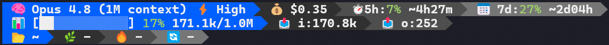

# ✦ Hawk Claude Statusline

A premium 3-line powerline status bar for [Claude Code](https://claude.ai/code).



## What it shows

**Line 1 - Session**
| Segment | Info |
|---------|------|
| 🧠 Model | Current Claude model (Opus 4.8, Sonnet, etc.) |
| ⚡ Effort | Reasoning effort level (Low → Max); hidden when the model has no effort setting |
| 💰 Cost | Estimated session cost based on token usage |
| ⏱ 5h | 5-hour usage quota with reset countdown |
| 📅 7d | 7-day usage quota with reset countdown |

**Line 2 - Context**
| Segment | Info |
|---------|------|
| 📊 Bar | Context window usage with progress bar |
| 📥 Input | Input tokens consumed |
| 📤 Output | Output tokens generated |

**Line 3 - Project**
| Segment | Info |
|---------|------|
| 📂 Dir | Current working directory |
| 🌿 Branch | Git branch name |
| 🔥 Changes | Lines added/deleted, staged/modified/untracked files |
| 🔄 Sync | Commits ahead/behind remote |

## Features

- Powerline-style segments with arrow transitions
- Real-time usage quota monitoring (5h + 7d windows)
- Git status with parallel commands for speed
- Smart caching (60s API, 5s git)
- Stale fallback when API is unavailable
- Color-coded percentages (green/yellow/red)
- Reasoning effort badge (low → max), shown next to the model
- Estimated session cost (pricing auto-detected per model)
- Works on macOS, Linux, and Windows (Git Bash) - finds Python automatically

## Install

### One-liner

```bash
curl -sL https://raw.githubusercontent.com/valentinhawk/hawk-claude-statusline/main/install.sh | bash
```

### With Claude Code

Copy and paste this prompt to Claude Code:

```
Install the Hawk Claude Statusline from https://github.com/valentinhawk/hawk-claude-statusline. Download statusline.py and statusline.sh to ~/.claude/scripts/, make statusline.sh executable, and add this to my ~/.claude/settings.json: "statusLine": { "type": "command", "command": "bash ~/.claude/scripts/statusline.sh", "timeout": 10000 }
```

### Manual

1. Download `statusline.py` and `statusline.sh` to `~/.claude/scripts/`
2. `chmod +x ~/.claude/scripts/statusline.sh`
3. Add to `~/.claude/settings.json`:

```json
{
  "statusLine": {
    "type": "command",
    "command": "bash ~/.claude/scripts/statusline.sh",
    "timeout": 10000
  }
}
```

4. Restart Claude Code

## Requirements

- Python 3.8+
- Claude Code CLI
- A terminal with powerline font support

## Customization

Edit the palette in `statusline.py`:

```python
# Accent color (256-color code)
BG_ACCENT = "\033[48;5;27m"  # 27 = dodger blue
# Try: 93 (violet), 33 (blue), 30 (teal), 196 (red), 208 (orange)

# Gray gradient
BG_G1 = "\033[48;5;236m"  # dark
BG_G2 = "\033[48;5;239m"  # medium
BG_G3 = "\033[48;5;243m"  # light
```

## Windows Terminal

If you see rendering artifacts below the status line, enable built-in glyphs:

```json
"font": {
    "builtinGlyphs": true
}
```

## Troubleshooting

**Statusline is blank / install failed on Windows.** On a fresh Windows, typing
`python3` opens the Microsoft Store stub instead of running Python, so a naive
`python3 || python` launcher silently fails. The wrapper here tries `py`, then
`python`, then `python3`, and verifies each one actually runs before using it,
so it works out of the box. If Python is installed somewhere unusual, set an
explicit path in your shell: `export CLAUDE_PY=/c/path/to/python`.

**`bash: command not found` (Windows).** The statusline command runs through
`bash`, which comes with [Git for Windows](https://git-scm.com/download/win).
Install it, then restart Claude Code.

## License

© 2026 ValentinHawk. Free to use, modify, and distribute with attribution.
